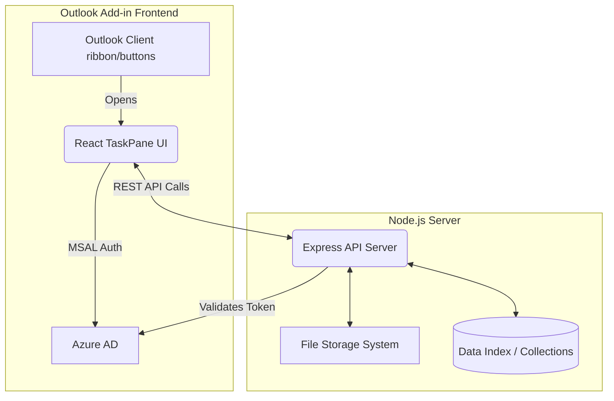

# Koyomail - Email Filing Outlook Add-in


**Koyomail** is a professional Microsoft Outlook Add-in designed to streamline the process of filing selected emails and their attachments directly into designated project locations and collections. 

---

## 📖 Overview

The Koyomail Add-in provides a seamless ribbon interface within Outlook (for both Read and Compose modes) allowing users to file critical emails without leaving their inbox. It features a modern React-based TaskPane UI and a robust Node.js backend to securely handle file operations, user authentication via MSAL, and collection management.

---

## ✨ Features

- **File Email**: Quickly file selected emails and attachments to mapped project folders via the native TaskPane.
- **Collections Management**: View and manage shared project collections and filing locations.
- **Modern UI/UX**: Built with `@fluentui/react-components` for a native Microsoft 365 look and feel.
- **Secure Authentication**: Integrated with Azure AD / MSAL for robust Single Sign-On (SSO) and delegated permissions (`Mailbox.ReadWrite.User`).
- **Upcoming Features**: Advanced Search and customizable Options (slated for future milestones).

---

## 🏗️ Architecture

Koyomail is divided into two primary components: the **Client (Outlook Add-in)** and the **Backend (Express API)**.



- **Frontend (`/src`)**: A React Single Page Application loaded inside an Outlook WebView. It handles user interactions, MSAL authentication, and communicates with the backend.
- **Backend (`/backend`)**: A Node.js Express server that processes filing requests, manages folder structures, indexes data, and handles the actual storage of `.eml` and attachment files.

---

## 🚀 Getting Started

### Prerequisites

- Node.js (v16 or higher recommended)
- npm or yarn
- Microsoft 365 Account (for Outlook Add-in side-loading)
- Office Add-in CLI (`npm install -g office-addin-cli`)

### Installation & Setup

1. **Clone/Download the repository** to your local machine.

2. **Install Frontend Dependencies:**
   ```bash
   npm install
   ```

3. **Install Backend Dependencies:**
   ```bash
   npm run backend:install
   # Alternatively: cd backend && npm install
   ```

4. **Generate Local Dev Certificates:**
   To run the Outlook Add-in locally, you need trusted SSL certificates.
   ```bash
   npx office-addin-dev-certs install
   ```

### Running the Application

To run the full stack locally for development:

1. **Start the Backend Server:**
   ```bash
   npm run backend:dev
   ```
   *This starts the Express server using nodemon for hot-reloading.*

2. **Start the Frontend & Sideload to Outlook:**
   Open a new terminal window and run:
   ```bash
   npm start
   ```
   *This will start the webpack dev server on port 3000 and automatically attempt to sideload the `manifest.json` into your local Outlook desktop client.*

---

## 📜 Available Scripts

From the root directory, you can run the following npm scripts:

- `npm start` - Starts the dev server and sideloads the Add-in into Outlook.
- `npm stop` - Stops the Add-in debugging session.
- `npm run build` - Builds the frontend React app for production.
- `npm run watch` - Runs webpack in development watch mode.
- `npm run lint` / `npm run prettier` - Code quality and formatting checks.
- `npm run backend:dev` - Starts the backend server in dev mode.
- `npm run backend:start` - Starts the backend server in production mode.
- `npm run backend:reindex` - Runs the backend indexing script.

---

## 📁 Project Structure

```text
Koyomail/
├── .vscode/               # VS Code debugging configurations
├── assets/                # Icons and static assets for the Add-in manifest
├── backend/               # Node.js Express Backend
│   ├── src/               # Backend source code (API routes, services, etc.)
│   ├── data/              # Data storage/indexing
│   ├── file-storage/      # Local file storage (if applicable)
│   └── package.json       # Backend dependencies
├── src/                   # React Frontend Source
│   ├── taskpane/          # TaskPane React components and logic
│   └── commands/          # Ribbon commands logic (commands.js)
├── manifest.json          # Unified Outlook Add-in Manifest (Teams/M365 format)
├── manifest.addin.xml     # Legacy XML Add-in Manifest
├── package.json           # Frontend dependencies and root scripts
└── webpack.config.js      # Webpack configuration for the React app
```

---

## 🔐 Security & Permissions

The Add-in requires the following permissions as defined in the manifest:
- **Mailbox.ReadWrite.User**: Required to read the selected email's metadata, download attachments, and potentially apply categories/tags after filing.

## 📅 Roadmap

- **Milestone 1**: Foundation & Ribbon Setup ✅
- **Milestone 2**: Core Email & Attachment Filing, Collections Management ✅ (Current)
- **Milestone 3**: Advanced Global Search & Options Configuration 🚧

---

*This project is built using the [Office Add-in TaskPane React JS](https://github.com/OfficeDev/Office-Addin-TaskPane-React-JS) template.*
